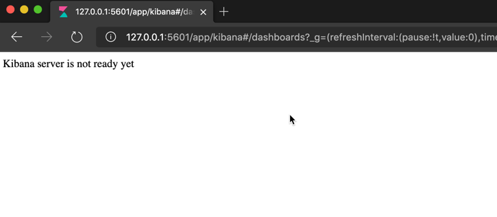
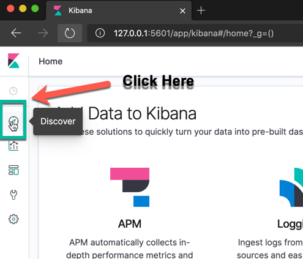
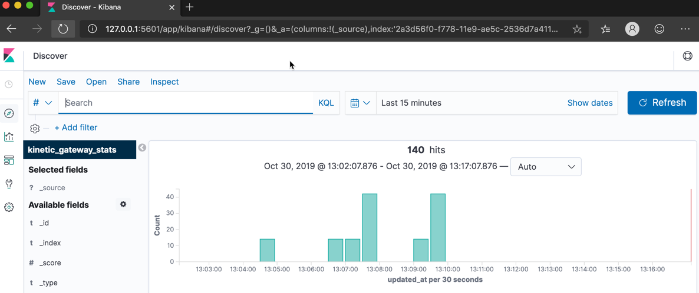
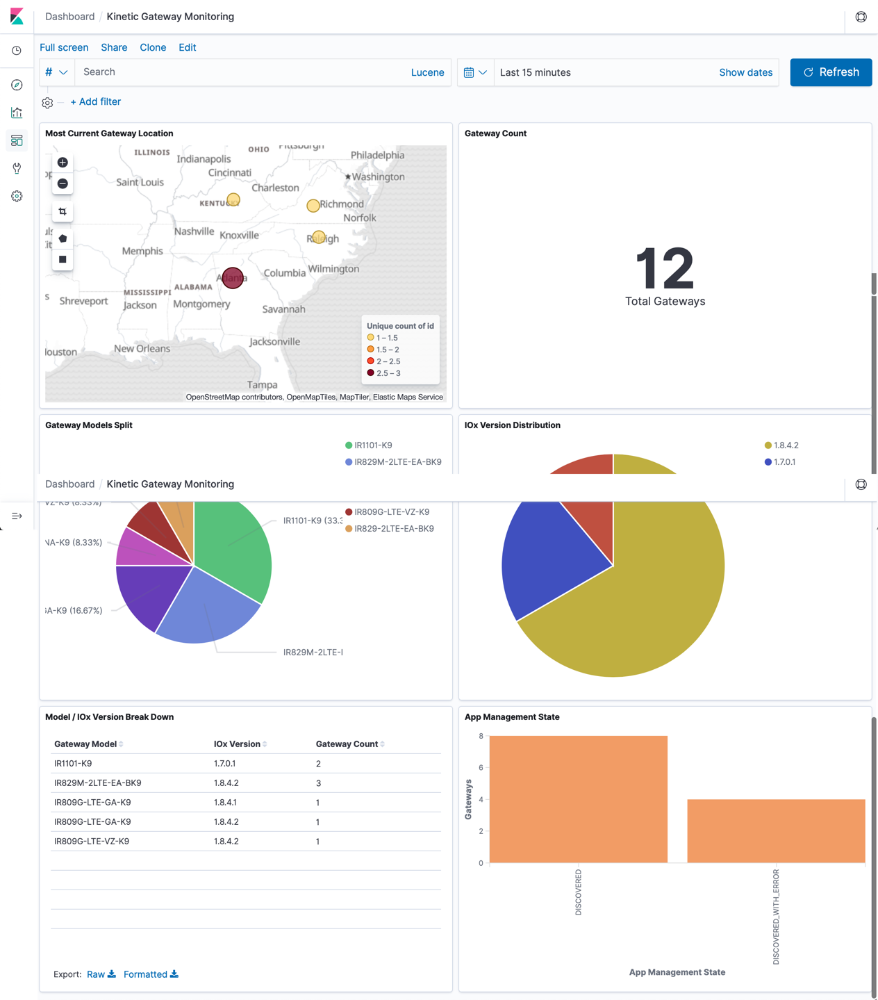

# Kinetic GMM Gateway Telemetry Data Services

This App automatically populates Kinetic Gateway info into Elasticsearch and Kibana for easy to use, API driven, EdgeCompute/Gateway telemetry. Allows you to monitor all vital information out of your gateways and even see mapped out gps location of gateways if enabled.

> Setup: The instructions here are used to help you get up and running quickly with the use of docker compose.

## Prereqs for using this Automation

1. Minimum of at least one admin account and associated username and password on a https://us.ciscokinetic.io org.
2. Docker for Windows, Docker for Mac, or Docker and DockerCompose on Linux (Docker compose comes with Docker for Windows and Docker for Mac)
3. Git installed on your computer
4. Ability for your desktop computer / dev environment to access

## Up and running

> If you have the above prerequisites this should be quite easy to start up.

* Open a terminal or commmand prompt
  
* In your terminal / command prompt window use `git clone https://github.com/CiscoDevNet/gmm-gw-data-collect` to download this code repo from github.
  
* In your terminal / command prompt window change directories into your repository `cd gmm-gw-data-collect`
  
* retrieve an org ID from the Kinetic site

The easiest way to get this done is to login in to the Kinetic cloud site (https://us.ciscokinetic.io), selecting an org and grabbing the org ID from the end of the URL `https://us.ciscokinetic.io/organizations/<orgId>`.  We will use the org ID collected for the next steps of the configuration file.

* In the `gmm-gw-data-collect` directory,open the `docker-compose.yml` file in your favorite text editor.
  
* Edit lines 34, 35, and 36 of the `docker-compose.yml` file to reflect your login e-mail, login password, and org ID from your Kinetic account.

```yaml
      KINETIC_USER_EMAIL: user@email.com
      KINETIC_USER_PASS: somepass
      KINETIC_ORG_ID: 0000

```

> If you do not edit these values to your correct login information, the app will be unable to populate the dashboard correctly.

> Optionally: If you are more familiar with Elasticsearch and Kibana and you don't want use the prebuilt dashboard, you can also edit line 44 of the docker-compose.yml file to a value of "no".

### If account is eu.ciscokinetic.io

This application defaults to using us.ciscokinetic.io for API calls for US based users.  However, if you are using Kinetic in europe you will need to edit one more line on your docker-compose.yml file to use this app appropriately.

* On line 46 on the `docker-compose.yml` file change the value to match the correct Kinetic URL.

From

```yaml
      KINETIC_URL: us.ciscokinetic.io
```

To

```yaml
      KINETIC_URL: eu.ciscokinetic.io
```

* Save your changes to the `docker-compose.yml` file and exit your text editor.

* In your terminal window, issue the following commands to start the application.

```bash
docker-compose -f docker-compose.yml up -d
```

You should see the following output

```bash
Creating network "gmm-gw-data-collect_elk" with driver "bridge"
Creating gmm-gw-data-collect_elasticsearch_1 ... done
Creating gmm-gw-data-collect_kibana_1        ... done
Creating gmm-gw-data-collect_gmm_stats_1     ... done
```

* Once it is done starting the application you can navigate to http://127.0.0.1:5601 in a web browser.

> Note: Your exact Kibana URL address might be different if you are running this on a remote dev environment or if you have a specific setup for docker on your desktop that could be different from standard.

If the below image looks like your response to the website, it might take a minute or two more for the server to be ready.  Refresh in a few minutes before it comes up.



* when the Kibana site has fully loaded, click the discover button on the left hand side.



* Depending on how many gateways you have available in your org your results should look similar, but not exact to below.



Click the refresh button a few times if your data has not loaded yet.

> If No results show up after a few minutes, inspect the docker-compose.yml file to make sure your login information is correct, execute the `docker-compose -f docker-compose.yml down` command and then `docker-compose -f docker-compose.yml up -d` to restart.

Once you are showing the the database has hits you can view the prebuilt dashboard.

* Go to http://127.0.0.1:5601/app/kibana#/dashboard/5851a2b0-f991-11e9-ae5c-2536d7a4115e?_g=(refreshInterval:(pause:!f,value:60000),time:(from:now%2Fd,to:now%2Fd)) and you will see a prebuilt dashboard of data you are getting back from Kinetic to monitor your gateways.

> You may not seen any gateways on your map if GPS is not enabled.

> Also, you can add visualizations and build your own dashboards with your gateway data now that it is being collected in Elasticsearch and accessible through Kibana.

Your dashboard will look similar but not exactly like the image below.



## Issues

If you find any problems, please raise an issue in GitHub so that we might be able to help you.

## Contributions

If you wish to contribute code or updates to this repo, please...

1. fork this repo
2. commit any changes to your forked repo
3. Sign off on all your commits
4. Open a pulle request from your forked repo to this repo for us to review.

## License

This repo is using a standard MIT License which is available in the license file.